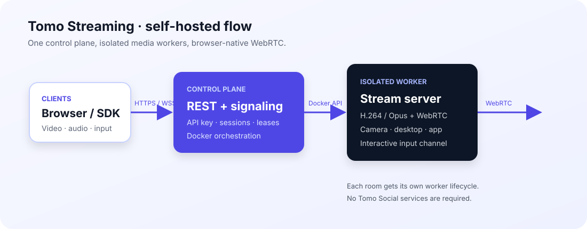
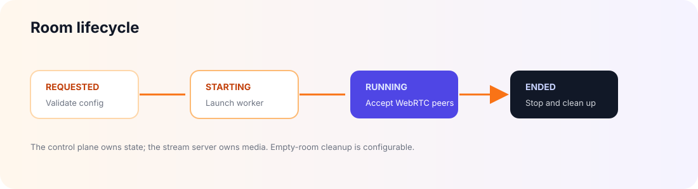

<div align="center">

# Tomo Streaming — Self-hosted

### Run interactive camera, desktop and custom WebRTC streams on your own Linux infrastructure.

[](docker-compose.yml)
[](https://webrtc.org/)
[](#quick-start)
[](LICENSE.md)

[Quick start](#quick-start) · [Public docs](https://tomo-docs.pages.dev) · [Requirements](#requirements) · [Sources](#capture-sources) · [Production](#production-checklist)

</div>

This repository is the smallest supported deployment of Tomo Streaming. It runs the standalone control plane and launches one isolated stream-server container per live session through the Docker socket.

It does **not** deploy the Tomo social network, user accounts, a frontend or a database.

## Architecture

The control plane owns room state and worker orchestration. Each active room gets an isolated stream-server container for media capture, encoding and interactive input.





For the complete API and deployment reference, see the [public documentation](https://tomo-docs.pages.dev).

## Requirements

- Linux host or VM
- Docker Engine with Compose v2
- At least 2 CPU cores and 1 GiB RAM per concurrent 720p stream
- A public HTTPS/WSS reverse proxy for internet clients
- TURN for restrictive NAT or firewall environments
- Source-specific access: V4L2 for camera, X11 for desktop, PulseAudio for system audio

> [!WARNING]
> The control plane mounts `/var/run/docker.sock`. Treat it as a privileged infrastructure service: keep the REST API behind TLS, use a long API key, restrict network access and run it on a dedicated worker when possible.

## Quick start

```bash
git clone https://github.com/Tomo-Social/tomo-streaming-self-hosted.git
cd tomo-streaming-self-hosted
cp .env.example .env
```

Generate a server-side secret and place it in `.env`:

```bash
openssl rand -base64 32
```

Set both image variables to published tags or images you built locally, then start the stack:

```bash
docker compose up -d
docker compose ps
```

Verify discovery:

```bash
curl http://localhost:8090/health
curl http://localhost:8090/api/v1/stream-servers
```

> [!NOTE]
> Tomo Streaming is currently in developer preview. Version `0.1.0` images are published in GHCR; use [Build images locally](#build-images-locally) when developing a modified runtime.

## Choose a deployment path

| Path | Best for | Status |
| --- | --- | --- |
| **Self-hosted** | Teams that need control of media, data and infrastructure | Available now |
| **Tomo Streaming Cloud** | Fast room creation without managing workers | Coming soon |

The self-hosted runtime is independent from Tomo Social. You can embed it into an existing product through the [Streaming SDK](https://github.com/Tomo-Social/tomo-streaming-sdk) or build a custom client against the API.

## Configuration

| Variable | Required | Description |
| --- | --- | --- |
| `TOMO_STREAM_API_KEY` | Yes | 24+ character backend credential |
| `TOMO_STREAMING_CONTROL_PLANE_IMAGE` | Yes | Control-plane image tag |
| `TOMO_AV_STREAM_SERVER_IMAGE` | Yes | Camera/desktop runtime image tag |
| `STREAM_SERVER_SIGNALING_URL` | Yes | WebSocket URL reachable from stream-server containers |
| `TOMO_STREAM_INSTANCE_ID` | Recommended | Unique worker ownership label |
| `MAX_STREAM_SESSIONS` | No | Concurrent local session ceiling; default `4` |
| `PUBLIC_IP` | Internet deployments | Public ICE address |
| `TURN_URL`, `TURN_USERNAME`, `TURN_PASSWORD` | Recommended | TURN relay credentials |

Do not commit `.env`; it is ignored by Git.

## Capture sources

Only configure resources that exist on the worker.

### Camera

```dotenv
CAMERA_DEVICE_HOST=/dev/video0
```

The API may expose that device inside the session container as `/dev/video0`. Confirm permissions with `v4l2-ctl --list-devices` on the Linux host.

### Desktop

```dotenv
X11_SOCKET_HOST=/tmp/.X11-unix
PULSE_SOCKET_HOST=/run/user/1000/pulse
```

The captured X11 display is selected per session using `config.display`, such as `:0`.

### Interactive input

```dotenv
INPUT_SOCKET_HOST_DIR=/srv/tomo/input
```

Each session receives its own Unix datagram socket path. Attach a separately sandboxed input agent to translate the versioned SDK packets into application-specific commands or OS events.

## Build images locally

Clone the sibling repositories next to this one:

```bash
git clone https://github.com/Tomo-Social/tomo-streaming-control-plane.git
git clone https://github.com/Tomo-Social/tomo-stream-server.git

docker build -t tomo-streaming-control-plane:local ./tomo-streaming-control-plane
docker build -f ./tomo-stream-server/Dockerfile.av -t tomo-av-stream-server:local ./tomo-stream-server
```

Update `.env`:

```dotenv
TOMO_STREAMING_CONTROL_PLANE_IMAGE=tomo-streaming-control-plane:local
TOMO_AV_STREAM_SERVER_IMAGE=tomo-av-stream-server:local
```

## Production checklist

- [ ] Terminate TLS and expose signaling through `wss://`.
- [ ] Keep the API key in a secret manager.
- [ ] Pin control-plane and stream-server images to a release tag or immutable digest; do not use `latest` in production.
- [ ] Rotate `TOMO_STREAM_API_KEY` on a documented schedule and after any suspected exposure.
- [ ] Configure TURN and test from a mobile network.
- [ ] Restrict inbound ports with a firewall; expose only the reverse proxy and required TURN ports.
- [ ] Restrict access to the Docker socket and worker network.
- [ ] Set CPU, memory and concurrent-session budgets for the host.
- [ ] Use a unique `TOMO_STREAM_INSTANCE_ID` per control plane.
- [ ] Monitor `/health`, container exits, CPU, memory, peer counts and session startup latency.
- [ ] Forward structured logs to a central sink and configure alerts for repeated worker failures.
- [ ] Load-test the configured `MAX_STREAM_SESSIONS` limit before inviting users.
- [ ] Document a rollback procedure and keep the previous known-good image tags available.
- [ ] Confirm camera, desktop and audio capture consent with every participant before publishing a room.
- [ ] Back the control plane with shared leases before running multiple replicas.

## Ecosystem

| Repository | Role |
| --- | --- |
| [tomo-streaming-control-plane](https://github.com/Tomo-Social/tomo-streaming-control-plane) | API, WebRTC signaling and orchestration |
| [tomo-stream-server](https://github.com/Tomo-Social/tomo-stream-server) | C++ media runtimes |
| [tomo-streaming-sdk](https://github.com/Tomo-Social/tomo-streaming-sdk) | TypeScript API and input client |

## License

Source-available under the [PolyForm Noncommercial License 1.0.0](LICENSE.md). Commercial self-hosting and commercial services require a separate license from Tomo.

---

<div align="center"><strong>Your infrastructure. Your media. The same Tomo Streaming API.</strong></div>
